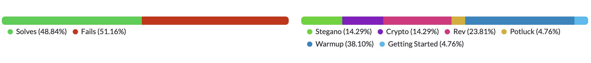
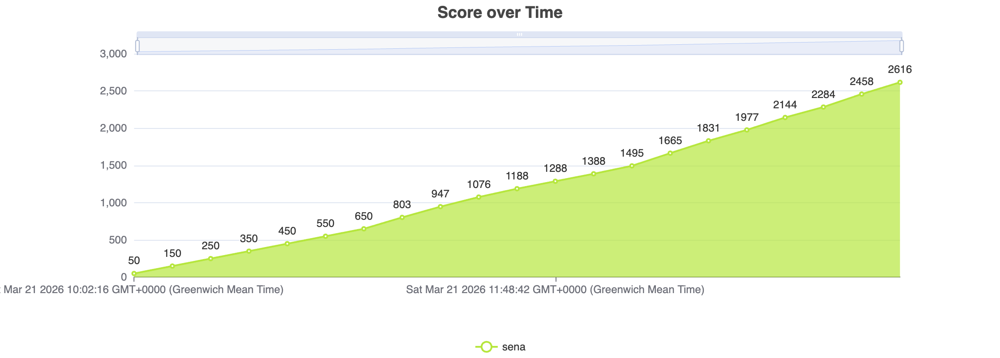
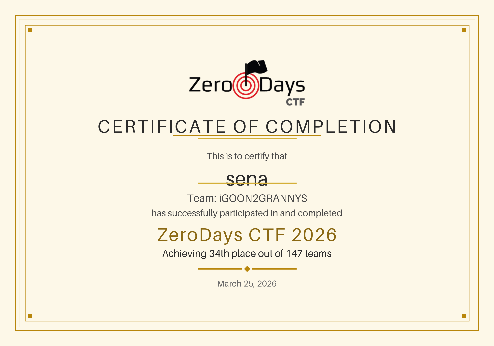

# ZeroDays CTF 2026 - Complete Writeups Collection

A comprehensive collection of writeups for all challenges from the ZeroDays CTF 2026 competition.

## Challenge Summary

| # | Challenge | Category | Difficulty | Flag |
|---|-----------|----------|------------|------|
| 1 | [Integer Overflow](01-Integer-Overflow.md) | Binary Exploitation | Medium | `ZeroDays{test_integer_overflow_vulnerability_n3g4t1v3_qty}` |
| 2 | [Osaka Oracle](02-Osaka-Oracle.md) | Cryptography | Hard | `ZeroDays{https://youtu.be/pquWcqqd_b4}` |
| 3 | [Basic RSA](03-Warmup-Basic-RSA.md) | Warmup | Easy | `ZeroDays{basic_rsa_with_python}` |
| 4 | [U WOT M8](04-Warmup-Base64-Layers.md) | Warmup | Easy | `ZeroDays{we_hate_the_clankers}` |
| 5 | [r1ckr0ll.ps1](05-Warmup-PowerShell-Rickroll.md) | Warmup | Easy | `ZeroDays{n3v3r_g0nn4_l3t_y0u_down}` |
| 6 | [karen](06-Rev-Karen-XOR.md) | Reverse Engineering | Medium | `ZeroDays{d0_u_kn0w_wh0_1_@m?!}` |
| 7 | [DogeMiner](07-Rev-DogeMiner-PyInstaller.md) | Reverse Engineering | Medium | `ZeroDays{w0w_such_r3v3rs3_much_str1ngs}` |
| 8 | [bonk.sys](08-Rev-Bonk-Kernel-TEA.md) | Reverse Engineering | Hard | `ZeroDays{k3rn3lm0d3b0nk}` |
| 9 | [vibe_checker.pyc](09-Rev-Vibe-Checker-Bytecode.md) | Reverse Engineering | Hard | `ZeroDays{v1b3_ch3ck_p4ss3d}` |
| 10 | [FlagShop](10-Web-FlagShop-Logic-Bug.md) | Web Exploitation | Easy | `ZeroDays{basic_rsa_with_python}` |
| 11 | [FlagShop Round 2](11-Web-FlagShop-Round2.md) | Web Exploitation | Easy | `ZeroDays{basic_rsa_with_python}` |
| 12 | [challenge.png](12-Stego-DrawIO-Hidden-Image.md) | Steganography | Medium | `ZeroDays{n3v3r_g0nn4_l3t_y0u_down}` |
| 13 | [challenge_2.jpg](13-Stego-JPEG-Comment.md) | Steganography | Easy | `ZeroDays{ex1f-d4ta-h0ldz-many-s3rets!}` |
| 14 | [spongebob.jpg](14-Stego-Spongebob-Mocked-Base64.md) | Steganography | Medium | `zerodays{bawkbwakbkawkbawkbawk}` |
| 15 | [rare_pepe.png](15-Stego-Rare-Pepe-LSB.md) | Steganography | Hard | `ZeroDays{f33ls_g00d_m4n_h1dd3n_byT3s}` |
| 16 | [LEGO Set](16-OSINT-LEGO-Set.md) | OSINT | Medium | `zerodays{Coast Guard Head Quarters}` |
| 17 | [Pixel Art](17-Stego-Pixel-Art-Nibble-Encoding.md) | Steganography | Medium | `ZeroDays{p1xel_4rt-is-th3_b3st-steg0-m3thod!}` |
| 18 | [Quantum Collapse](18-Crypto-Quantum-Collapse.md) | Cryptography | Hard | Retrieved from server |

## Statistics

**Completed Challenges**: 18/21

### Certificate

### By Category
| Category | Percentage | 
|----------|-----------|
| Cryptography | 14.29% |
| Stegano| 14.29% |
| Rev | 23.81% |
| Potluck | 4.76% |
| Warmup | 38.10% |
| Getting Started | 4.76% |

### By Difficulty
| Difficulty | Challenges |
|------------|-----------|
| Easy | 6 |
| Medium | 6 |
| Hard | 4 |
| Warmup | 3 |

## License

This repository is licensed under the MIT License - see the LICENSE file for details.

---
**Competition**: ZeroDays CTF 2026  
**Participant**: sena  
**Score**: 18 challenges completed
